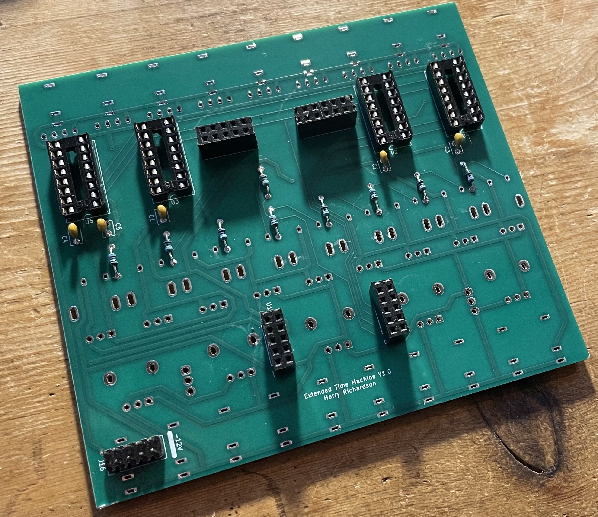
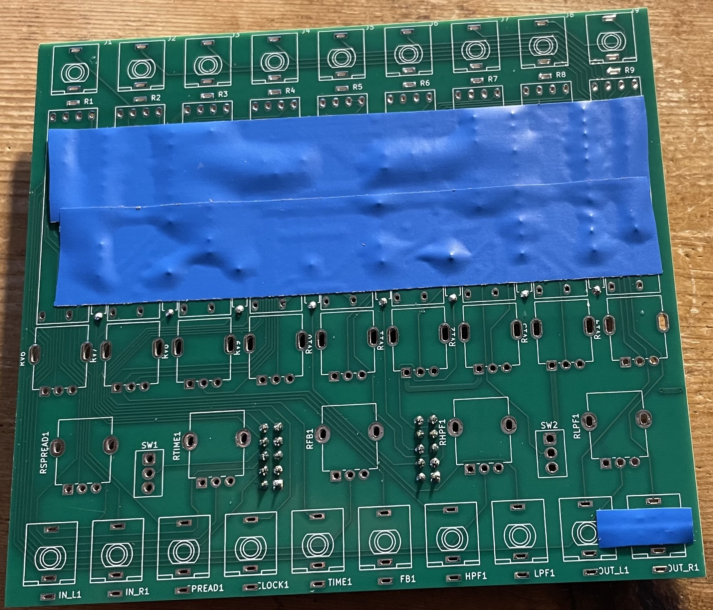

# Tap-O-Matic

A delay created by Harry Richardson based on the source code from the Olivia Artz Time Machine

## BOM
 - 9 * Bournes sliders (PTL30-15R0-104B2).
 - 9 * B10K - Song Huei TALL Trimmer Potentiometer with Detent
 - 5 * B10K Alpha vertical 9mm pots with 6.35mm shaft
 - 19 * Thonkicon Mono Jacks
 - 2 * SaleCom ES-4 mini toggle switches
 - 1 * DG408 multiplexer
 - 3 * 4051 multiplexer
 - 9 * 820R resistors (exact value doesn't matter - these set the LED brightness. Anything between about 800 and 1000 ohms should be good).
 - 4 * 16-pin DIP sockets.
 - 5 * 100nF capacitors
 - 1 * Daisy Patch Submodule
 - 4 * 2x5 headers (to connect to the Daisy).
 - 1 * 2x5 power connector (with no shroud - there isn't room!)
 - Knobs to taste :-)

Thonk should be good for the pots, the tall trimmers with detents, and the jacks.

https://www.thonk.co.uk/shop/alpha-9mm-pots/ (B10K, Vertical mount)

https://www.thonk.co.uk/shop/ttpots/ (B10K, Get the ones with the centre detent!)

https://www.thonk.co.uk/shop/thonkiconn/

The hard one is the switches. I got mine from JPR Electronics, where I they call it the "IP67 vertical on-on" switch.

https://www.jprelec.co.uk//categories/components/switches-and-sensors/toggle-switches/salecom-es-40t-ip67-sealed-submin-toggle-switch/product/ip67-toggle-spdt-vertical-on-on/800-295~800-295

The Daisy Submodule can be bought from Juno. It was actually cheaper to buy it from their Ebay store rather than their own website. Not sure if that's still the case.

https://www.ebay.co.uk/itm/405345530695

The rest are all generally available: Digikey, Mouser, RS, Farnell...

## Front Panel
I got mine made by MeFace in the UK: send an email with an attached PDF or SVG to sales@meface.co.uk for a quote.

The files are available here: https://github.com/cormallen/tap-o-matic/tree/main/panel

## Build Instructions
The components have to be soldered in the right order, since some of the components cover the solder holes of others.

### Back side components.
First solder all the components on the back side of the board:

 - List item
 - IC Sockets
 - Capacitors
 - Resistors (shown on the silkscreen as being on the front, but put them on the back!)
 - Headers
 - Power connector.

This is how should look when you're done.

 ### Trim the ends

Because the sliders (and two jack sockets) go on top of backside components, you need to trim the ends that poke through to the front side as close to the board as is easily possible (just for those components that go under the sliders and jacks).

### Insulate

Next, we need to put some electrical tape (or other insulator) on the front side, so that the sliders and jacks don't touch any of our solder.

### Jacks and Pan Pots

Place the jacks and pan pots in their holes. Put the front panel on them (to make sure everything is perfectly aligned), do up the nuts on the jacks to hold everything in place and then flip the board over so that you can solder it all in.

For the two jacks that go over the power connector, you may need to trim just a little bit of the plastic (less than 1mm!) out from the sides so that they can fit flush to the board. This can be done with a pair of dikes, a file or a dremmel.

Take the panel back off again.

### Sliders, Pots and Switches.

Place the rest of the front panel hardware on the board, put the front panel on, then flip it over and solder.

Note that the sliders are EXTREMELY close to the pan pots, as I was trying to give as much room for fingers on the main knobs as possible. According to the datasheets, this should have been fine, but **if I did another revision then I would move the pan pots down by 1mm (and update the front panel!)**. Fortunately the sliders actually have a good bit of play in them, so you should be able to get them in fine. (But make sure the pan pots are soldered first, since you need those to be perfectly aligned with the front panel holes).

## Flashing Firmware

You can download the firmware image here: https://github.com/cormallen/tap-o-matic/tree/main/binaries

You can flash the firmware either by setting up VSCode or by using the Web Programmer. VSCode is overkill unless you need a dev environment anyway, or you want to make changes to the code.

Instructions for the Web Programmer method: https://www.youtube.com/watch?v=UaUJ3N8i57c

Instructions for the VSCode method: https://github.com/electro-smith/DaisyWiki/wiki/1.-Setting-Up-Your-Development-Environment

*The video I've linked for the Web Programmer is for QuBit modules, but the process is identical, and that's the simplest explanation I could find.*
